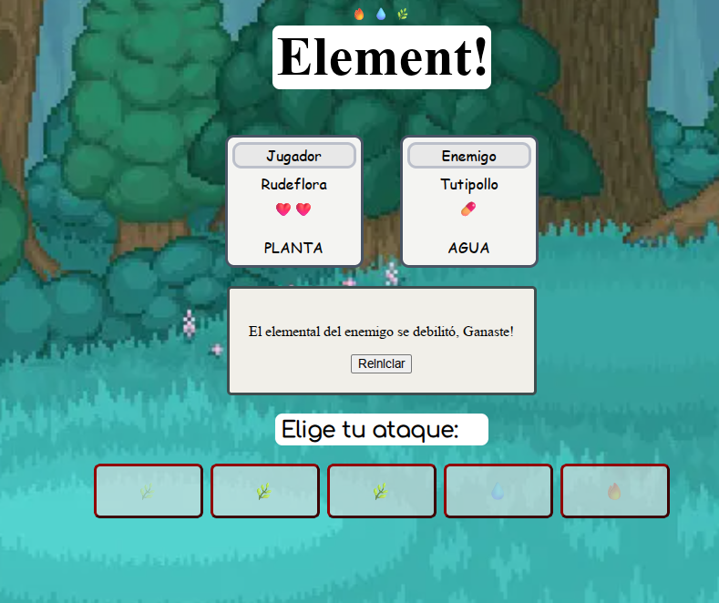

# 🔥💧🌿 Elemental Clash - Un Piedra, Papel o Tijera Evolucionado

## 🎮 Descripción  
**Elemental Clash** es un juego tipo **Piedra, Papel o Tijera**, pero con una mecánica ampliada basada en **tres tipos elementales**: **Fuego, Agua y Planta**. Cada jugador elige un personaje con un tipo predominante, lo que afecta el daño y las resistencias en el combate.  

## 🔥🌿💧 Tipos Elementales y Mecánicas  
Cada personaje tiene una **predominancia elemental** que influye en la batalla:  

- **Tutipollo (Fuego predominante) 🔥**  
  - Hace más daño a **Planta** 🌿  
  - Recibe menos daño de **Fuego y Planta**  
  - Es débil contra **Agua** 💧  

- **Rudeflora (Planta predominante) 🌿**  
  - Hace más daño a **Agua** 💧  
  - Recibe menos daño de **Planta y Agua**  
  - Es débil contra **Fuego** 🔥  

- **Aleatron (Agua predominante) 💧**  
  - Hace más daño a **Fuego** 🔥  
  - Recibe menos daño de **Agua y Fuego**  
  - Es débil contra **Planta** 🌿  

## 🛠️ Tecnologías Usadas  
Este juego fue desarrollado utilizando:  
- **HTML5** 🎨 para la estructura  
- **CSS3** 🎭 para los estilos  
- **JavaScript** ⚡ para la lógica del juego  

## 🚀 Cómo Jugar  
1. Selecciona tu personaje entre **Tutipollo, Rudeflora o Aleatron**  
2. El sistema generará un oponente aleatorio  
3. Se comparan los tipos y se aplica el daño según las fortalezas y debilidades  
4. ¡Gana el mejor estratega!  

## 📸 Capturas de Pantalla  
  

## 📥 Instalación y Uso  
1. Descarga el repositorio  
2. Abre `index.html` en tu navegador  
3. ¡Disfruta el juego!  

## 🤝 Contribuciones  
Si tienes ideas para mejorar **Elemental Clash**, ¡cualquier contribución es bienvenida!  

## 📜 Licencia  
Este proyecto está bajo la **MIT License**.  
